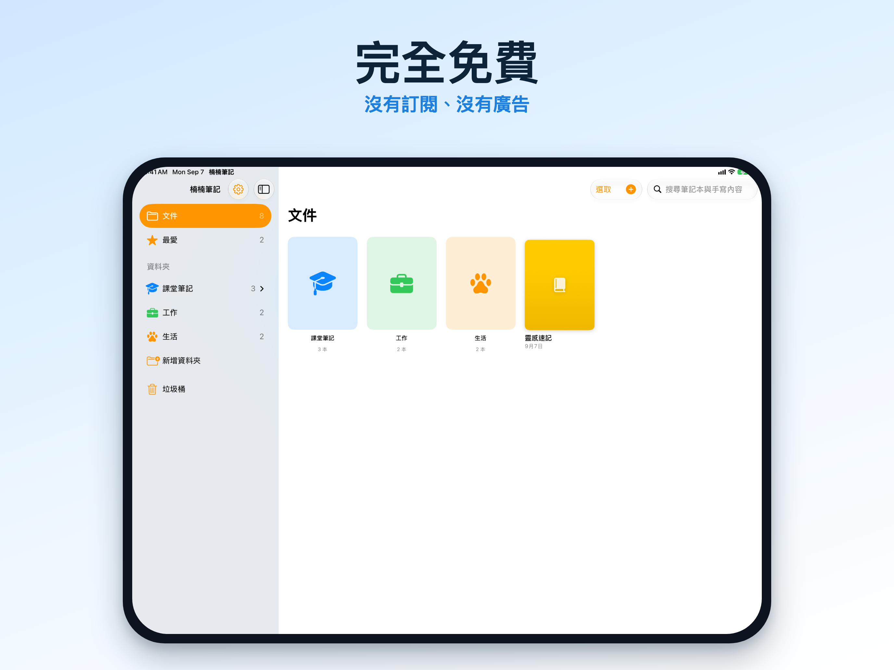
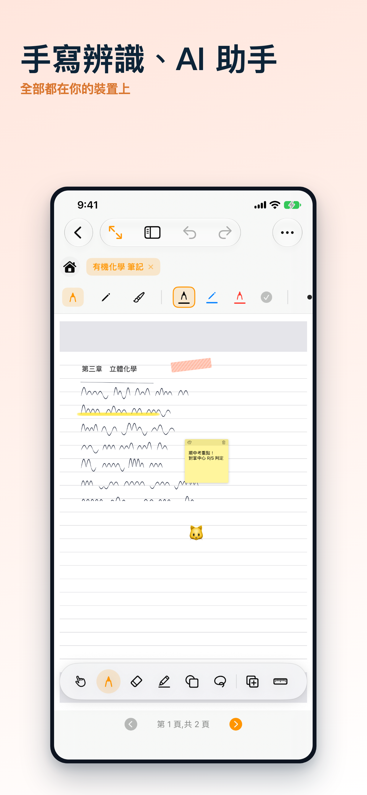

  

  # 楠楠筆記 NanNanCat Notes

  **完全免費的手寫筆記 App，沒有訂閱、沒有廣告、沒有功能限制。**

  由台灣一位大學生獨立開發，以我的貓「楠楠」命名 🐾

  [官方網站](https://notes.nannancat.tw) · [隱私權政策](https://notes.nannancat.tw/privacy) · [Discord 社群](https://discord.gg/wC5n3p8n)

---

## 這是什麼

楠楠筆記是給 iPad / iPhone 用的手寫筆記 App，靈感來自 GoodNotes、Notability 這類產品，但走完全不同的路線：**不訂閱、不收費、不用帳號**。

一個人開發、一個人維護，這個 repo 是給想了解這個 App 在做什麼的人看的介紹頁——**不包含原始碼**，程式碼是私有的。

## 特色功能

- ✍️ **手寫筆記**：多種筆刷、螢光筆、可調整長度與刻度的尺規、形狀辨識，畫歪的線條/矩形/橢圓/三角形會自動校正；**曲線工具**能把徒手畫的線條自動變成平滑曲線，畫函數圖形特別方便；手寫筆跡還能一鍵整理成工整的樣子
- 🗂️ **圖層**：頁面可以分成多個圖層管理，個別顯示/隱藏、鎖定，整理複雜筆記更清楚
- 🧽 **分類橡皮擦**：除了標準/精確/整筆畫擦除，還可以只擦螢光筆、只擦形狀、只擦膠帶，不會動到不該動的筆跡
- 🎙️ **錄音同步筆記**：邊錄音邊寫筆記，播放時點擊任一段筆跡就能跳到寫下那段內容當時的錄音時間點
- 🤖 **AI 助手**：摘要、重點整理、校對、翻譯，預設用裝置端運算，不上傳、不用網路也能用；也可以選擇串接自己的雲端 AI 金鑰（OpenAI / Google Gemini / Anthropic Claude）取得更進階的功能，例如手寫數學公式辨識、**逐步解數學題**、**詞句翻譯朗讀**——串接雲端服務前一定會先讓你確認要傳送什麼內容到哪個服務商
- 🧮 **學習小工具**：內建計算機、番茄鐘專注計時器（支援鎖定畫面與動態島即時顯示進度）、AI 產生的問答式閃卡複習
- 🎤 **Siri 與捷徑**：用語音就能請楠楠筆記開始番茄鐘、新增筆記本，或是用裝置端 AI 問筆記本裡寫了什麼
- 📄 **多格式檔案匯入**：PDF、PowerPoint、Excel、Word 都能直接匯入變成筆記頁面；PDF 表單欄位會自動偵測並保留可互動填寫；也內建文件掃描器，紙本筆記直接掃描存檔，不用再花錢轉檔
- 📖 **手寫轉印刷體閱讀**：一鍵把手寫轉換成清楚的印刷體文字，還能朗讀給你聽；內建多款開源可商用字型可選，也能自行匯入喜歡的字型
- 🏷️ **彈性標籤**：側邊欄標籤系統可以跨資料夾篩選，也可以直接在筆記裡打 `#標籤` 自動歸類
- 🎨 **範本、封面與主題**：康乃爾筆記法、五線譜、週計畫、課表等多種頁面範本，可自訂顏色的筆記本封面，還有類似即時通訊軟體聊天背景那種柔和主題色可選；課表範本能一鍵把上課時間加進裝置的行事曆
- 🔗 **雙向連結**：筆記之間互相連結、自動列出反向連結，打造你自己的知識網路
- ☁️ **多元雲端同步**：iCloud 自動同步，也可以選擇額外備份到 Google 雲端硬碟、OneDrive 或 WebDAV；主畫面與鎖定畫面小工具可快速打開最近的筆記本、查看番茄鐘進度
- 🔒 **隱私優先**：沒有帳號系統、沒有廣告、沒有追蹤、沒有第三方 SDK，你的筆記只存在你自己的裝置和你自己的雲端帳號裡

## 支援語言

繁體中文・English・日本語・한국어

## 螢幕截圖

  
  

## 聯絡方式

有任何問題、建議，或是想許願新功能，歡迎透過 [Discord](https://discord.gg/wC5n3p8n) 或 [jundazhu@nannancat.tw](mailto:jundazhu@nannancat.tw) 聯繫。

---

  © 2026 Junda Chu · 本 repository 僅供產品介紹使用，不包含原始碼

